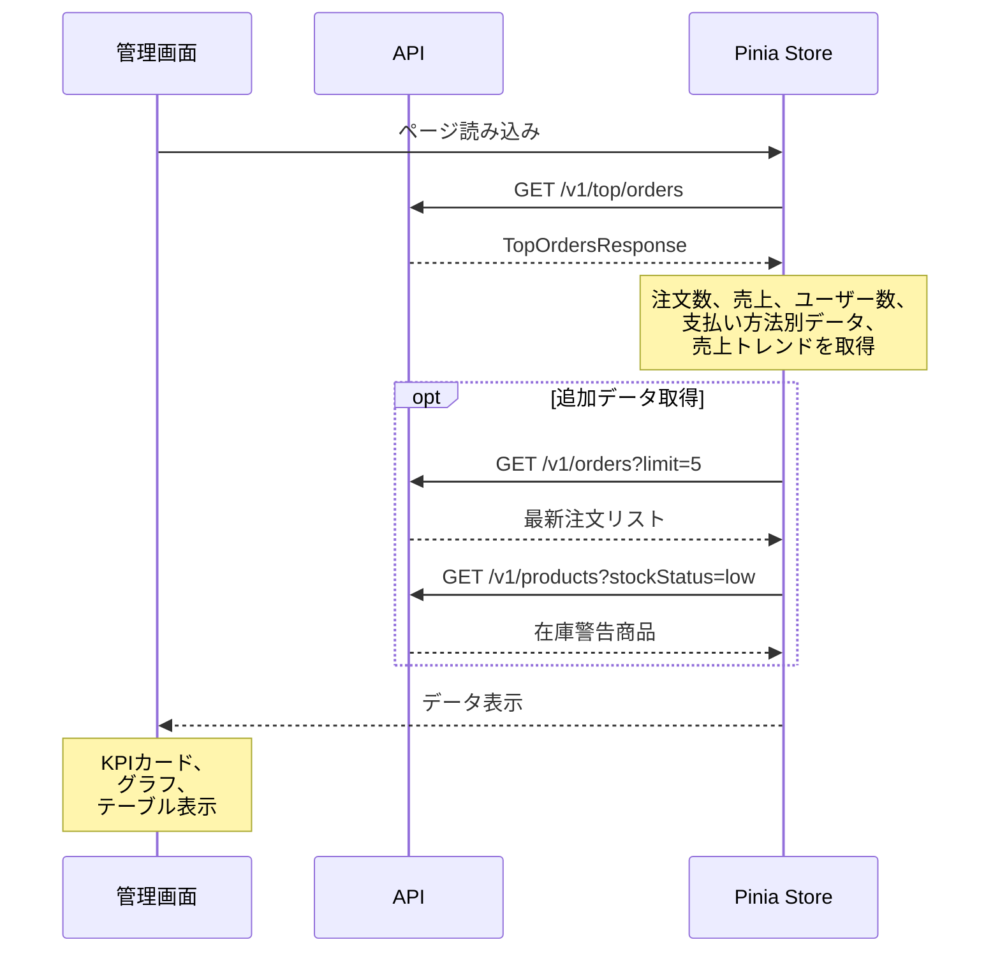

# 管理画面ダッシュボード改善

| 項目 |  |
|----|--|
| 機能 | 管理画面トップページ（ダッシュボード）の情報充実化 |

## 仕様

<!-- 仕様書（Asana/DocBase）リンクを貼る -->

## 設計概要

現在の管理画面トップページは売上グラフのみの簡素な表示となっているため、既存APIで取得可能なデータを最大限活用し、管理者が一目で重要な情報を把握できるダッシュボードに改善する。

## 設計詳細

### Web

#### エンドポイント

- `/` - 管理画面トップページ（既存・改修）
- 使用コンポーネント:
  - `/web/admin/src/pages/index.vue` （改修）
  - `/web/admin/src/components/templates/HomeTop.vue` （改修）
  - `/web/admin/src/components/molecules/dashboard/DashboardKpiCard.vue` （新規）
  - `/web/admin/src/components/molecules/dashboard/DashboardChart.vue` （新規）

### API

#### エンドポイント

既存APIを活用（新規エンドポイント不要）:
- `GET /v1/top/orders` - 注文統計データ取得（既存）
- `GET /v1/orders` - 最新注文一覧取得（既存・オプション）
- `GET /v1/products` - 商品在庫状況取得（既存・オプション）

#### シーケンス

## チェックリスト

### 実装開始前

- [ ] 既存のTopOrdersResponseの全データ項目を確認
- [ ] Vuetifyのカードコンポーネントの仕様確認
- [ ] EChartsの円グラフ実装方法の確認
- [ ] レスポンシブデザインの考慮

### 動作確認

- [ ] KPIカードの数値が正しく表示される
- [ ] 前期比の色分け（プラス：緑、マイナス：赤）が機能する
- [ ] 期間選択（日/週/月）の切り替えが正常動作する
- [ ] グラフが正しくレンダリングされる
- [ ] モバイル表示でレイアウトが崩れない

## リリース時確認事項

### リリース順

APIの変更がないため、Webのみのリリースで問題なし

### リリース制御

特になし（Feature Flag不要）

### インフラ設定

環境変数の変更なし

### パフォーマンスチェック

- 初回ロード時のAPI呼び出し回数を最小限に抑える（現状維持）
- 追加データ取得を実装する場合は`Promise.all()`で並列化

### その他

- 既存のTopStoreを拡張せず、互換性を保つ
- 将来的にダッシュボード専用のStoreを作成する場合の拡張性を考慮

## 関連リンク

- [管理画面トップページ](/web/admin/src/pages/index.vue)
- [HomeTopコンポーネント](/web/admin/src/components/templates/HomeTop.vue)
- [TopStore](/web/admin/src/store/top.ts)