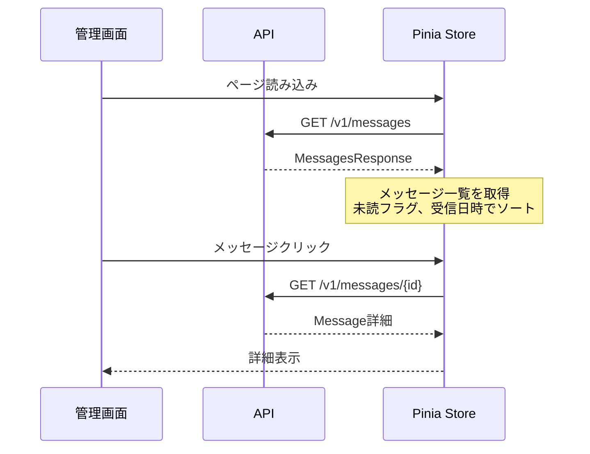

# メッセージ一覧画面UI改善

| 項目 |  |
|----|--|
| 機能 | 管理画面メッセージ一覧のUI/UX改善 |

## 仕様

<!-- 仕様書（Asana/DocBase）リンクを貼る -->

## 設計概要

現在のメッセージ一覧画面は固定レイアウト（2:10の分割）で、モバイル対応やユーザビリティに課題があるため、モダンなメールクライアント風のUIに改善する。

## 設計詳細

### Web

#### エンドポイント

- `/messages` - メッセージ一覧ページ（既存・改修）
- 使用コンポーネント:
  - `/web/admin/src/pages/messages/index.vue` （既存・変更なし）
  - `/web/admin/src/components/templates/MessageList.vue` （改修）

### API

#### エンドポイント

既存APIを活用（新規エンドポイント不要）:
- `GET /v1/messages` - メッセージ一覧取得（既存）
- `GET /v1/messages/{messageId}` - メッセージ詳細取得（既存）

#### シーケンス

## 改善内容

### 現状の問題点

1. **固定レイアウト**: 2:10の固定比率でレスポンシブ対応なし
2. **視認性の悪さ**: 
   - メッセージリストが狭すぎて内容が見づらい
   - 未読/既読の区別が不明瞭
   - 日時情報がない
3. **UXの問題**:
   - リストと詳細の切り替えが不自然
   - モバイルでの操作性が悪い
   - 空状態の表示が味気ない

### 改善案

1. **レスポンシブレイアウト**
   - デスクトップ: 4:8の黄金比レイアウト
   - タブレット: 5:7の調整レイアウト
   - モバイル: リスト/詳細の切り替え式

2. **メッセージリストの改善**
   - プレビュー付きのリッチなリスト表示
   - 未読バッジと受信日時の表示
   - ホバー/選択状態の視覚的フィードバック
   - 検索フィルター機能（将来的に）

3. **詳細表示の改善**
   - ヘッダー情報の充実（送信者、日時、カテゴリ等）
   - 読みやすいタイポグラフィ
   - アクションボタンの配置

4. **視覚的改善**
   - マテリアルデザインのelevation活用
   - 適切な余白とグリッド
   - アイコンとカラーの効果的な使用

## チェックリスト

### 実装開始前

- [x] 現在のMessageListコンポーネントの構造確認
- [x] Vuetifyのレスポンシブ機能の確認
- [ ] メッセージデータ構造の確認（read, receivedAt等）
- [ ] モバイルファーストの設計検討

### 動作確認

- [ ] デスクトップ表示（1920px）
- [ ] タブレット表示（768px）
- [ ] モバイル表示（375px）
- [ ] 未読/既読の状態変更
- [ ] リスト選択時の詳細表示
- [ ] 空状態の表示

## リリース時確認事項

### リリース順

フロントエンドのみの変更のため、単独リリース可能

### リリース制御

特になし（Feature Flag不要）

### インフラ設定

環境変数の変更なし

### パフォーマンスチェック

- メッセージ数が多い場合のリスト表示速度
- 仮想スクロールの検討（100件以上の場合）

### その他

- 既存のメッセージストアとの互換性維持
- メッセージの既読管理機能は将来的に実装予定

## 関連リンク

- [メッセージ一覧ページ](/web/admin/src/pages/messages/index.vue)
- [MessageListコンポーネント](/web/admin/src/components/templates/MessageList.vue)
- [MessageStore](/web/admin/src/store/message.ts)
