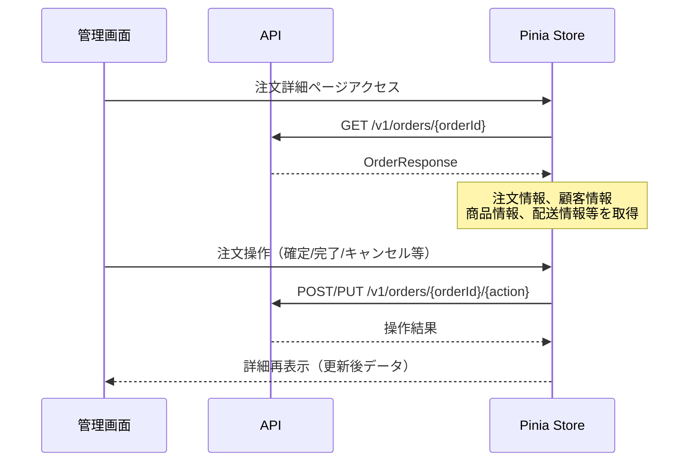

# 注文詳細画面UI改善

| 項目 |  |
|----|--|
| 機能 | 管理画面注文詳細のUI/UX改善 |

## 仕様

<!-- 仕様書（Asana/DocBase）リンクを貼る -->

## 設計概要

現在の注文詳細画面は情報の視認性が悪く、アクションボタンの配置も分かりづらいため、管理者が効率的に注文処理を行えるよう、より整理されたUIデザインに改善する。

## 設計詳細

### Web

#### エンドポイント

- `/orders/[id]` - 注文詳細ページ（既存・改修）
- 使用コンポーネント:
  - `/web/admin/src/pages/orders/[id]/index.vue` （既存・変更なし）
  - `/web/admin/src/components/templates/OrderShow.vue` （改修）

### API

#### エンドポイント

既存APIを活用（新規エンドポイント不要）:
- `GET /v1/orders/{orderId}` - 注文詳細取得（既存）
- その他注文操作API（capture, complete, cancel, refund等）

#### シーケンス

## 改善内容

### 現状の問題点

1. **情報の整理不足**:
   - 基本情報、支払情報、配送情報が分散している
   - 重要な情報（ステータス、金額等）の視認性が悪い
   - 関連する情報がまとまっていない

2. **UI/UXの問題**:
   - カード設計が統一されていない（elevation=0で枠線なし）
   - 情報階層が不明瞭
   - レスポンシブ対応が不十分

3. **操作性の問題**:
   - アクションボタンが最下部に固まっている
   - ボタンの状態（有効/無効）が分かりづらい
   - ステータスに応じた最適なアクションが見つけにくい

### 改善案

1. **情報アーキテクチャの再設計**
   - **ヘッダーセクション**: 注文番号、ステータス、重要指標
   - **概要セクション**: 基本情報と金額サマリー
   - **詳細セクション**: 商品/予約詳細、顧客・配送先情報
   - **アクションセクション**: 状態に応じた操作ボタン

2. **視覚的改善**
   - マテリアルデザインのelevationを効果的に活用
   - ステータスチップの色分けとサイズ調整
   - 金額情報の視認性向上（太字、大きなフォント）
   - アイコンとカラーの統一

3. **レスポンシブレイアウト**
   - デスクトップ: 2カラムレイアウト（8:4）
   - タブレット・モバイル: 1カラムスタック
   - 重要情報の優先表示

4. **アクション改善**
   - ステータス別のアクションパネル
   - プライマリアクションの強調表示
   - 危険なアクション（キャンセル・返金）の明確な区別

## チェックリスト

### 実装開始前

- [x] 現在のOrderShowコンポーネントの構造確認
- [x] 注文データ構造の確認（Order, Fulfillment等）
- [x] Vuetify Cardコンポーネントの設計方針確認
- [x] ステータス・アクション対応表の整理

### 動作確認

- [ ] デスクトップ表示（1920px）
- [ ] タブレット表示（768px）
- [ ] モバイル表示（375px）
- [ ] 各種ステータスでの表示確認
- [ ] アクションボタンの動作確認
- [ ] 商品注文とエクスペリエンス注文の表示確認

## リリース時確認事項

### リリース順

フロントエンドのみの変更のため、単独リリース可能

### リリース制御

特になし（Feature Flag不要）

### インフラ設定

環境変数の変更なし

### パフォーマンスチェック

- 注文商品数が多い場合のテーブル表示速度
- 配送詳細が複数ある場合の表示性能

### その他

- 既存の注文ストアとの互換性維持
- 各種アクション（確定、完了、キャンセル、返金）の動作確認

## 関連リンク

- [注文詳細ページ](/web/admin/src/pages/orders/[id]/index.vue)
- [OrderShowコンポーネント](/web/admin/src/components/templates/OrderShow.vue)
- [OrderStore](/web/admin/src/store/order.ts)
