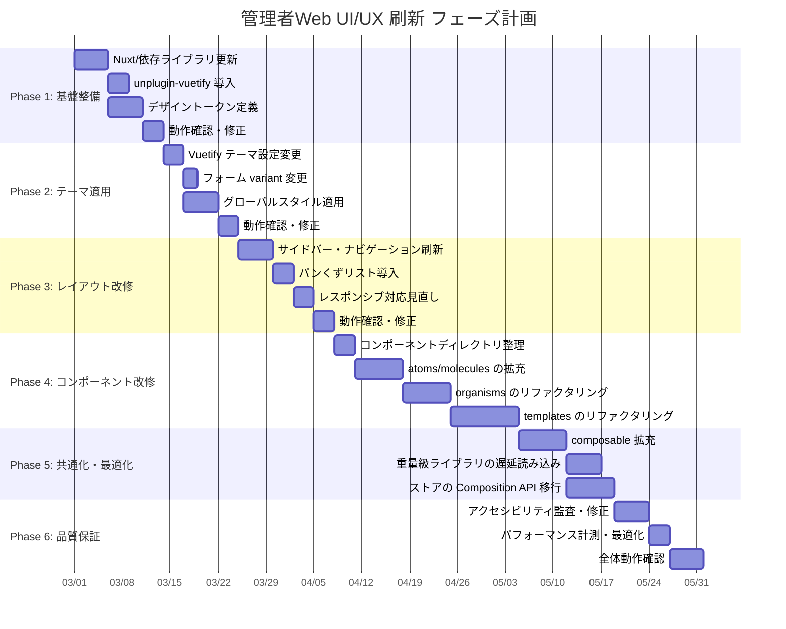

# 管理者Web UI/UX + Nuxt.js 刷新

| 項目 | 内容 |
|----|------|
| 機能 | 管理者Web（web/admin）の UI/UX 刷新およびNuxt.jsアップグレード |
| 作成日 | 2026-02-21 |
| ステータス | 設計中 |

## 仕様

- [全体設計（アーキテクチャ）](../../architecture/web/admin-ui-refresh.md)
- [デザインガイドライン（畑テーマ）](../../architecture/web/admin-design-guidelines.md)
- [技術選定 ADR](../../architecture/web/admin-ui-refresh-adr.md)

## 設計概要

ふるマル管理者Webを以下の方針で刷新する:

1. **UI/UX刷新**: 「畑テーマ」を採用し、農家にとって親しみやすい柔らかいデザインへ
2. **アクセシビリティ**: WCAG 2.2 Level AA 準拠。高齢者・低ITリテラシーユーザーに配慮
3. **技術スタック更新**: Nuxt 4.3.x へのアップグレード、依存ライブラリの最新化
4. **パフォーマンス最適化**: Vuetify Tree-shaking、重量級ライブラリの遅延読み込み
5. **コードベース改善**: コンポーネント整理、composable 拡充、デザイントークン導入

刷新は6フェーズに分けて段階的に実施し、各フェーズでリリース可能な状態を維持する。

## 設計詳細

### 全体フェーズ構成



---

### Phase 1: 基盤整備

**目的**: 技術スタックを最新化し、デザインシステムの基盤を構築する。

#### 1-1. Nuxt / 依存ライブラリの更新

**対象パッケージ**:

| パッケージ | 現行 | 目標 | 種別 |
|-----------|------|------|------|
| nuxt | 4.1.2 | 4.3.x | minor |
| @nuxt/devtools | 2.6.5 | 3.2.x | major |
| vue | 3.5.21 | 3.5.x 最新 | patch |
| vuetify | 3.10.4 | 3.10.x 最新 | patch |
| vite | 7.1.11 | 7.x 最新 | patch |
| typescript | 5.9.3 | 5.9.x 最新 | patch |
| @vueuse/core | 13.9.0 | 13.x 最新 | patch |
| @vueuse/nuxt | 13.9.0 | 13.x 最新 | patch |
| @tiptap/* | 2.26.x / 3.6.x | 最新 | patch/minor |
| pinia | 2.3.1 | 2.3.x 最新 | patch |
| eslint | 9.36.0 | 9.x 最新 | patch |

**手順**:

1. `yarn outdated` で全パッケージの更新状況を確認
2. パッチ更新を一括適用: `yarn upgrade`
3. マイナー/メジャー更新を個別適用:
   - `yarn add nuxt@^4.3`
   - `yarn add -D @nuxt/devtools@^3.2`
4. `yarn typecheck` で型エラーがないことを確認
5. `yarn dev` で起動確認
6. 全ページの手動動作確認

#### 1-2. unplugin-vuetify の導入

**目的**: Vuetify コンポーネントの Tree-shaking を有効化し、バンドルサイズを削減。

**手順**:

1. パッケージインストール: `yarn add -D vite-plugin-vuetify`
2. `nuxt.config.ts` に Vuetify プラグイン設定を追加
3. `plugins/vuetify.ts` から全量インポートを削除し、自動インポートに移行
4. `yarn build` でビルドエラーがないことを確認
5. バンドルサイズの前後比較

**変更ファイル**:

- `nuxt.config.ts` - Vite プラグイン追加
- `src/plugins/vuetify.ts` - インポート方式変更

#### 1-3. デザイントークンの定義

**目的**: カラー・スペーシング・タイポグラフィを CSS Custom Properties として体系化。

**作成ファイル**:

```
src/assets/styles/tokens/
├── _colors.scss      # カラーパレット + セマンティックカラー
├── _spacing.scss     # スペーシングスケール
├── _typography.scss  # フォントサイズ・行の高さ
├── _shadows.scss     # シャドウ定義
└── _index.scss       # 全トークンの統合エクスポート
```

**手順**:

1. `src/assets/styles/tokens/` ディレクトリを作成
2. 各トークンファイルを作成（値は[デザインガイドライン](../../architecture/web/admin-design-guidelines.md)参照）
3. `_index.scss` で全トークンを `@use` で統合
4. `main.scss` から `_index.scss` を読み込み
5. Vuetify テーマ設定（`plugins/vuetify.ts`）とトークンの値を整合

---

### Phase 2: テーマ適用

**目的**: 畑テーマのカラー・スタイルをアプリ全体に適用する。

#### 2-1. Vuetify テーマ設定の変更

**対象ファイル**: `src/plugins/vuetify.ts`

**変更内容**:

```typescript
// Before: Vuetify 組み込みカラーを直接使用
colors: {
  primary: colors.lightGreen.darken2,
  accent: colors.amber.darken1,
  // ...
}

// After: 畑テーマカラーを適用
colors: {
  primary: '#7cb342',        // 畑の緑（成長する若葉）
  'primary-light': '#dcedc8', // 淡い若葉
  accent: '#ffb300',          // 収穫の橙
  secondary: '#795548',       // 大地の茶
  info: '#26c6da',            // 清流の青
  warning: '#ffc107',         // 注意の黄
  error: '#ef5350',           // エラーの赤
  success: '#66bb6a',         // 成功の緑
  surface: '#ffffff',         // カード背景
  background: '#f1f8e9',      // ページ背景（若葉の淡緑）
}
```

#### 2-2. フォーム variant の変更

**対象ファイル**: `src/plugins/vuetify.ts`

**変更内容**:

```typescript
// Before
defaults: {
  VTextField: { variant: 'underlined' },
  VSelect: { variant: 'underlined' },
  // ...
}

// After
defaults: {
  VTextField: { variant: 'outlined', density: 'comfortable' },
  VTextarea: { variant: 'outlined', density: 'comfortable' },
  VSelect: { variant: 'outlined', density: 'comfortable' },
  VAutocomplete: { variant: 'outlined', density: 'comfortable' },
  VCombobox: { variant: 'outlined', density: 'comfortable' },
  VCard: { elevation: 0, rounded: 'lg' },
  VBtn: { rounded: 'lg' },
}
```

#### 2-3. グローバルスタイルの適用

**対象ファイル**: `src/assets/main.scss`, `src/assets/variables.scss`

**変更内容**:

1. `main.scss` にデザイントークンを読み込み
2. ページ背景色を `green-50`（`#f1f8e9`）に設定
3. カード用の柔らかいシャドウを定義
4. フォーカスリングのスタイルをカスタマイズ
5. 角丸のグローバルオーバーライド

---

### Phase 3: レイアウト改修

**目的**: ナビゲーション・レイアウトを高齢者に配慮した設計に刷新する。

#### 3-1. サイドバー・ナビゲーション刷新

**対象ファイル**: `src/layouts/default.vue`

**主な変更**:

1. ナビゲーション項目を基本的に展開状態に変更
2. アイコン + テキストラベルの併記を徹底
3. 現在位置（アクティブ項目）の視覚的強調を強化
4. ヘルプリンクをサイドバー下部に常設
5. ナビゲーション幅を 240px に固定（現行の可変幅から変更）

#### 3-2. パンくずリスト導入

**新規作成**: `src/components/atoms/AppBreadcrumbs.vue`

```vue
<!-- 使用例 -->
<AppBreadcrumbs :items="[
  { title: 'ホーム', to: '/' },
  { title: '商品管理', to: '/products' },
  { title: '商品編集' },
]" />
```

**対象ファイル**: 全テンプレートコンポーネントにパンくずリストを追加

#### 3-3. レスポンシブ対応の見直し

**変更内容**:

1. ブレークポイントの見直し（Mobile/Tablet/Desktop/Wide）
2. タブレット以下でのハンバーガーメニュー動作確認
3. コンテンツ最大幅 1200px の適用
4. タッチターゲットサイズの検証（最小 44×44px）

---

### Phase 4: コンポーネント改修

**目的**: コンポーネントを整理し、再利用性とメンテナンス性を向上させる。

#### 4-1. コンポーネントディレクトリの整理

**作業内容**:

1. `organisms/` 内にドメイン別サブディレクトリを作成
   - `products/`, `orders/`, `schedules/`, `videos/`, `coordinators/`
2. `templates/` 内にドメイン別サブディレクトリを作成
   - `products/`, `orders/`, `schedules/`, `auth/`, `settings/`
3. `molecules/` 内に機能別サブディレクトリを作成
   - `forms/`, `lists/`, `feedback/`
4. 既存ファイルを適切なサブディレクトリに移動
5. Nuxt の auto-import が正常に動作することを確認
6. 各ページからのインポートパスを更新（auto-import に依存している場合は不要）

#### 4-2. atoms/molecules の拡充

**新規作成候補**:

| コンポーネント | 層 | 用途 |
|-------------|-----|------|
| AppBreadcrumbs.vue | atoms | パンくずリスト |
| AppStatusBadge.vue | atoms | ステータスバッジ（色+アイコン+テキスト） |
| AppConfirmDialog.vue | molecules/feedback | 確認ダイアログ |
| AppAlert.vue | molecules/feedback | アラート表示 |
| AppEmptyState.vue | molecules/feedback | データなし状態の表示 |
| AppSearchFilter.vue | molecules/forms | 検索フィルターバー |
| AppSortButtons.vue | molecules/lists | ドラッグ代替の上下ボタン |

#### 4-3. organisms のリファクタリング

**方針**:

1. 各 organism コンポーネントの責務を確認
2. ビジネスロジックを composable に抽出
3. プレゼンテーション（表示）とロジック（データ取得・変換）を分離
4. ドメイン別サブディレクトリに配置

#### 4-4. templates のリファクタリング

**方針**:

1. 47個のテンプレートコンポーネントをドメイン別に分類
2. 共通パターン（一覧ページ、詳細ページ、編集ページ、新規作成ページ）を特定
3. 共通パターンのロジック（ページネーション、検索、CRUD操作）を composable に抽出
4. テンプレート内の直接的なストア操作を composable 経由に変更

---

### Phase 5: 共通化・最適化

**目的**: コードの共通化とパフォーマンス最適化を行う。

#### 5-1. composable の拡充

**新規作成候補**:

| composable | 用途 | 抽出元 |
|-----------|------|--------|
| `useListPage` | 一覧ページ共通（検索、ページネーション、ソート） | 各List系テンプレート |
| `useDetailPage` | 詳細ページ共通（データ取得、エラーハンドリング） | 各Show/Edit系テンプレート |
| `useFormPage` | フォームページ共通（バリデーション、送信、エラー表示） | 各New/Edit系テンプレート |
| `useFileUpload` | ファイルアップロード（プレビュー、バリデーション） | 画像・動画アップロード箇所 |
| `usePagination` | ページネーション制御 | 一覧ページ全般 |
| `useAuth` | 認証状態管理（ログイン状態、権限チェック） | auth ミドルウェア・各ページ |
| `useApiError` | API エラーハンドリング | 全API呼び出し箇所 |
| `useConfirmDialog` | 確認ダイアログ制御 | 削除操作箇所 |

#### 5-2. 重量級ライブラリの遅延読み込み

**対象**:

| ライブラリ | 使用箇所 | 遅延方式 |
|-----------|---------|---------|
| echarts + vue-echarts | ScheduleAnalytics, VideoAnalytics | defineAsyncComponent |
| chart.js + vue-chart-3 | HomeTop（ダッシュボード） | defineAsyncComponent |
| @tiptap/* | TiptapEditor | defineAsyncComponent |
| hls.js | ScheduleStreaming, VideoPreview | 動的import() |

**手順**:

1. 各ライブラリの使用箇所を特定
2. `defineAsyncComponent` でラップ
3. ローディング状態のフォールバックコンポーネントを用意
4. `yarn build` 後のチャンク分割を確認

#### 5-3. Pinia ストアの Composition API 移行

**方針**: 改修対象となったストアから順次 Composition API スタイルに移行。

**優先度**:

1. 高: `auth.ts`, `common.ts`（全ページで使用）
2. 中: `product.ts`, `order.ts`, `schedule.ts`（主要ドメイン）
3. 低: その他のドメインストア（改修時に対応）

---

### Phase 6: 品質保証

**目的**: アクセシビリティ・パフォーマンスの最終確認と品質保証。

#### 6-1. アクセシビリティ監査

**ツール**:

- axe DevTools（Chrome拡張）
- Lighthouse（Chrome DevTools）
- WAVE Web Accessibility Evaluator

**確認項目**:

- [ ] コントラスト比が WCAG 2.2 AA 基準を満たしている
- [ ] 全インタラクティブ要素のタッチターゲットが 44×44px 以上
- [ ] キーボードのみで全操作が可能
- [ ] フォーカスインジケータが全要素で視認可能
- [ ] ドラッグ操作に代替手段がある
- [ ] エラー表示が色のみに依存していない
- [ ] スクリーンリーダーでの基本操作が可能

#### 6-2. パフォーマンス計測

**計測項目**:

| 指標 | 目標値 | 計測方法 |
|------|--------|---------|
| バンドルサイズ（gzip） | 現行比 20%以上削減 | `yarn build` + vite-bundle-visualizer |
| 初期ロード時間 | 3秒以内 | Lighthouse Performance |
| ページ遷移時間 | 1秒以内 | Performance API |
| Largest Contentful Paint | 2.5秒以内 | Lighthouse |
| Cumulative Layout Shift | 0.1未満 | Lighthouse |

#### 6-3. 全体動作確認

**確認対象ページ**:

- [ ] ログイン・認証フロー
- [ ] ダッシュボード（ホーム）
- [ ] 商品一覧・詳細・作成・編集
- [ ] 注文一覧・詳細
- [ ] スケジュール一覧・詳細・作成・ライブ配信
- [ ] 動画一覧・詳細・作成・編集
- [ ] コーディネーター管理
- [ ] 生産者管理
- [ ] 顧客管理
- [ ] 通知管理
- [ ] プロモーション管理
- [ ] 管理者設定
- [ ] システム設定

---

### Web

#### エンドポイント（変更対象ページ）

全管理画面ページが対象。主要なルートは以下の通り:

- `/` - ダッシュボード
- `/products/**` - 商品管理
- `/orders/**` - 注文管理
- `/schedules/**` - スケジュール管理
- `/videos/**` - 動画管理
- `/coordinators/**` - コーディネーター管理
- `/producers/**` - 生産者管理
- `/customers/**` - 顧客管理
- `/notifications/**` - 通知管理
- `/promotions/**` - プロモーション管理
- `/administrators/**` - 管理者管理
- `/system` - システム設定
- `/auth/**` - 認証

### API

APIの変更は不要。フロントエンドのみの改修。

---

## チェックリスト

### 実装開始前

* [ ] デザインガイドライン（畑テーマ）のレビュー完了
* [ ] 技術選定 ADR のレビュー完了
* [ ] 全体設計（アーキテクチャ）のレビュー完了
* [ ] 各フェーズの優先度・スコープの合意
* [ ] 開発環境での Nuxt 4.3.x 動作確認
* [ ] unplugin-vuetify のPoC（概念実証）完了
* [ ] デザイントークンのカラーサンプル確認

### 動作確認

* [ ] Phase 1 完了後: 全ページの起動確認、型チェック通過
* [ ] Phase 2 完了後: テーマ適用の視覚確認（全ページ）
* [ ] Phase 3 完了後: ナビゲーション・レイアウトの操作確認
* [ ] Phase 4 完了後: リファクタリングによる機能退行がないこと
* [ ] Phase 5 完了後: パフォーマンス計測、バンドルサイズ比較
* [ ] Phase 6 完了後: アクセシビリティ監査通過、全ページ最終確認

## リリース時確認事項

### リリース順

各フェーズ完了後にリリース可能。フェーズ間の依存関係は以下の通り:

```
Phase 1 (基盤) → Phase 2 (テーマ) → Phase 3 (レイアウト) → Phase 4 (コンポーネント) → Phase 5 (最適化) → Phase 6 (品質)
```

各フェーズは独立してリリース可能だが、Phase 1 → 2 → 3 の順序は厳守。Phase 4〜6 は並行作業が一部可能。

### リリース制御

- Feature Flag は使用しない（フロントエンドのみの変更のため）
- 各フェーズ完了時にステージング環境でQAを実施
- 重大な視覚的変更（Phase 2, 3）は本番リリース前にスクリーンショット比較を実施

### インフラ設定

- 環境変数の変更: なし
- CDN キャッシュ: 各フェーズリリース時に CloudFront の Invalidation を実行
- ビルド設定: `nuxt.config.ts` の変更に伴い CI/CD のビルドステップを確認

### パフォーマンスチェック

- Phase 1 完了後: バンドルサイズの前後比較（unplugin-vuetify 導入効果）
- Phase 5 完了後: Lighthouse スコア計測、遅延読み込みの効果確認
- Phase 6 完了後: 最終パフォーマンス計測

### その他

- デザイン変更は全ページに影響するため、主要ページのスクリーンショットを Phase 2 リリース前に取得し比較用に保存
- 高齢者ユーザーによるユーザビリティテストを Phase 3 完了後に実施することを推奨

## 関連リンク

- [全体設計（アーキテクチャ）](../../architecture/web/admin-ui-refresh.md)
- [デザインガイドライン（畑テーマ）](../../architecture/web/admin-design-guidelines.md)
- [技術選定 ADR](../../architecture/web/admin-ui-refresh-adr.md)
- [フロントエンドアプリケーション構成](../../architecture/web/frontend-applications.md)
- [既存の設計決定](../../architecture/design-decisions.md)
