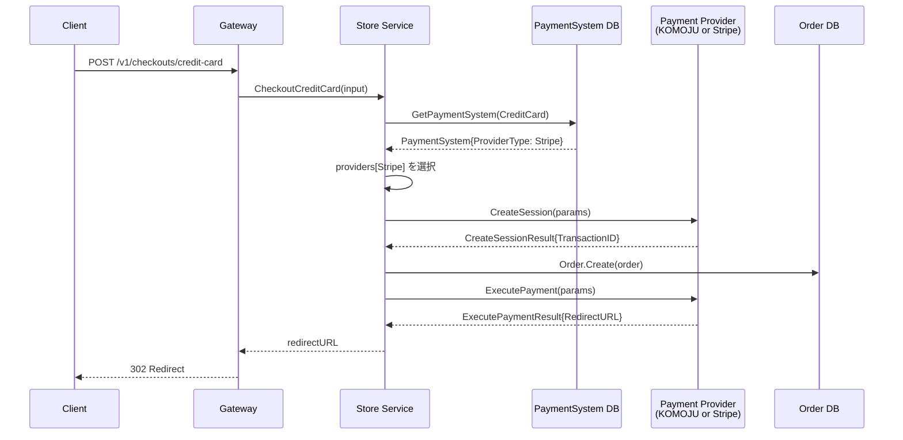
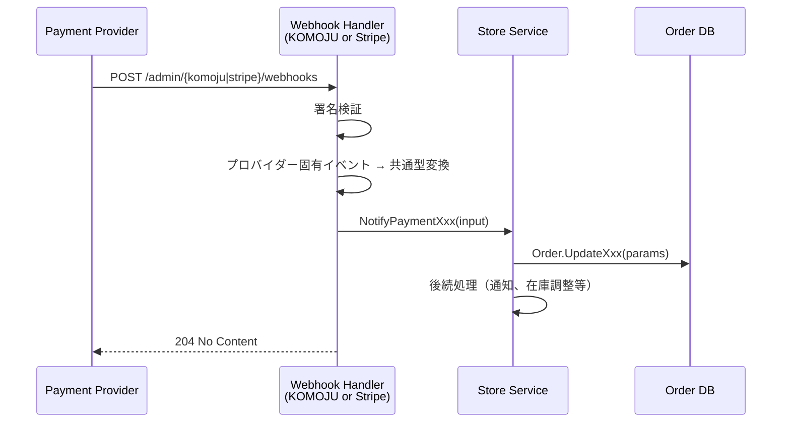

# 決済プロバイダー抽象化設計

| 項目 |  |
|----|--|
| 機能 | 決済処理のマルチプロバイダー対応 |

## 背景

現在、決済処理は KOMOJU に密結合しており、以下の問題がある。

1. **ベンダーロックイン**: service 層から KOMOJU の Session/Payment インターフェースを直接呼び出し
2. **エンティティ層の結合**: `order_payment.go` が `komoju` パッケージを直接インポート（`NewPaymentStatus()`, `NewKomojuPaymentTypes()`）
3. **プロバイダー識別の欠如**: `OrderPayment` にどの決済代行会社を利用したかの情報がない
4. **PaymentSystem テーブルの情報不足**: 決済手段の稼働状態のみ管理し、どのプロバイダーを使用しているかの情報がない

## 設計概要

`api/internal/store/payment/` パッケージに決済プロバイダーの共通インターフェースを定義し、その配下に `komoju/`、`stripe/` の詳細実装を配置する。service 層はインターフェース経由でのみ決済処理を呼び出す。

```
api/internal/store/
├── payment/                         # 決済プロバイダー抽象化層（新規）
│   ├── provider.go                  # 共通インターフェース定義
│   ├── types.go                     # プロバイダー共通型定義
│   ├── komoju/                      # KOMOJU 実装
│   │   ├── provider.go              # Provider インターフェース実装
│   │   ├── session.go               # セッション管理（既存 komoju/ から移設）
│   │   ├── webhook.go               # Webhook イベント変換
│   │   └── convert.go               # KOMOJU ↔ 共通型の変換
│   └── stripe/                      # Stripe 実装（新規）
│       ├── provider.go              # Provider インターフェース実装
│       ├── webhook.go               # Webhook イベント変換
│       └── convert.go               # Stripe ↔ 共通型の変換
├── komoju/                          # 既存 KOMOJU API クライアント（pkg 的位置づけで残す）
│   ├── komoju.go                    # Payment/Session インターフェース（変更なし）
│   ├── payment/                     # Payment 実装（変更なし）
│   ├── session/                     # Session 実装（変更なし）
│   ├── api.go, code.go, ...         # 既存ファイル（変更なし）
│   └── ...
└── service/
    ├── service.go                   # komoju → payment.Provider に差し替え
    ├── checkout.go                  # KOMOJU 直接呼び出し → Provider 経由に変更
    └── checkout_event.go            # KOMOJU 直接呼び出し → Provider 経由に変更
```

## 設計詳細

### 1. 共通インターフェース定義

#### `api/internal/store/payment/provider.go`

```go
package payment

import "context"

// ProviderType は決済代行会社の種別を表す。
type ProviderType int32

const (
    ProviderTypeUnknown ProviderType = 0
    ProviderTypeKomoju  ProviderType = 1
    ProviderTypeStripe  ProviderType = 2
)

// Provider は決済プロバイダーの共通インターフェース。
// service 層はこのインターフェース経由でのみ決済処理を呼び出す。
type Provider interface {
    // Type はプロバイダー種別を返す。
    Type() ProviderType

    // === セッション管理 ===

    // CreateSession は決済セッション（トランザクション）を作成する。
    // KOMOJU: Session.Create → SessionID を返す
    // Stripe: PaymentIntent.Create → PaymentIntentID を返す
    CreateSession(ctx context.Context, params *CreateSessionParams) (*CreateSessionResult, error)

    // GetSessionStatus は決済セッションの最新ステータスを取得する。
    GetSessionStatus(ctx context.Context, transactionID string) (PaymentStatus, error)

    // CancelSession は決済セッションをキャンセルする。
    CancelSession(ctx context.Context, transactionID string) error

    // === 決済実行 ===

    // ExecutePayment は決済手段に応じた支払い処理を実行する。
    // KOMOJU: Session.OrderXxx → RedirectURL を返す
    // Stripe: PaymentIntent.Confirm → RedirectURL or client_secret を返す
    ExecutePayment(ctx context.Context, params *ExecutePaymentParams) (*ExecutePaymentResult, error)

    // === 売上管理 ===

    // Capture は仮売上を実売上に確定する。
    Capture(ctx context.Context, paymentID string) error

    // Cancel は決済をキャンセルする（実売上前）。
    Cancel(ctx context.Context, paymentID string) error

    // Refund は返金処理を行う（実売上後）。
    Refund(ctx context.Context, params *RefundParams) error

    // === 決済情報照会 ===

    // GetPayment は決済情報を照会する。
    GetPayment(ctx context.Context, paymentID string) (*PaymentInfo, error)
}
```

#### `api/internal/store/payment/types.go`

```go
package payment

import "time"

// PaymentStatus はプロバイダー非依存の決済ステータス。
type PaymentStatus int32

const (
    PaymentStatusUnknown    PaymentStatus = 0
    PaymentStatusPending    PaymentStatus = 1
    PaymentStatusAuthorized PaymentStatus = 2
    PaymentStatusCaptured   PaymentStatus = 3
    PaymentStatusCanceled   PaymentStatus = 4
    PaymentStatusRefunded   PaymentStatus = 5
    PaymentStatusFailed     PaymentStatus = 6
    PaymentStatusExpired    PaymentStatus = 7
)

// CreateSessionParams はセッション作成パラメータ。
type CreateSessionParams struct {
    OrderID         string
    Amount          int64
    CallbackURL     string
    MethodType      int32  // entity.PaymentMethodType の値
    Customer        *Customer
    BillingAddress  *Address
    ShippingAddress *Address
}

type Customer struct {
    ID    string
    Name  string
    Email string
}

type Address struct {
    ZipCode      string
    Prefecture   string
    City         string
    AddressLine1 string
    AddressLine2 string
}

type CreateSessionResult struct {
    TransactionID string // KOMOJU: SessionID, Stripe: PaymentIntentID
}

// ExecutePaymentParams は決済実行パラメータ。
type ExecutePaymentParams struct {
    TransactionID string // CreateSession で取得した ID
    MethodType    int32  // entity.PaymentMethodType の値
    // 決済手段固有パラメータ（クレジットカード情報、顧客情報等）
    CreditCard    *CreditCardParams
    BankTransfer  *BankTransferParams
    Konbini       *KonbiniParams
    Customer      *Customer
    BillingAddress *Address
}

type CreditCardParams struct {
    Name              string
    Number            string
    Month             int64
    Year              int64
    VerificationValue string
    Email             string
}

type BankTransferParams struct {
    Email         string
    PhoneNumber   string
    Lastname      string
    Firstname     string
    LastnameKana  string
    FirstnameKana string
}

type KonbiniParams struct {
    Store string // コンビニ店舗種別
    Email string
}

type ExecutePaymentResult struct {
    RedirectURL string // 決済画面への遷移先 URL
    PaymentID   string // KOMOJU: PaymentID, Stripe: PaymentIntentID
    Status      PaymentStatus
}

type RefundParams struct {
    PaymentID   string
    Amount      int64
    Description string
}

type PaymentInfo struct {
    ID     string
    Status PaymentStatus
}

// WebhookEvent はプロバイダーから受信した Webhook イベント。
// 各プロバイダーの Webhook ハンドラーがプロバイダー固有イベントを
// この共通型に変換してから service 層に通知する。
type WebhookEvent struct {
    ProviderType ProviderType
    EventType    WebhookEventType
    OrderID      string
    PaymentID    string
    IssuedAt     time.Time
    // 返金関連（Refunded/Canceled イベント時のみ）
    RefundTotal  int64
    RefundReason string
}

type WebhookEventType int32

const (
    WebhookEventTypeUnknown   WebhookEventType = 0
    WebhookEventTypeAuthorized WebhookEventType = 1
    WebhookEventTypeCaptured   WebhookEventType = 2
    WebhookEventTypeFailed     WebhookEventType = 3
    WebhookEventTypeExpired    WebhookEventType = 4
    WebhookEventTypeCanceled   WebhookEventType = 5
    WebhookEventTypeRefunded   WebhookEventType = 6
)
```

### 2. エンティティ変更

#### `entity/payment_system.go` への変更

```go
// PaymentSystem に決済代行会社情報を追加
type PaymentSystem struct {
    MethodType   PaymentMethodType   `gorm:"primaryKey;<-:create"` // 決済種別
    Status       PaymentSystemStatus `gorm:""`                     // 決済システム状態
    ProviderType PaymentProviderType `gorm:""`                     // 決済代行会社（新規追加）
    CreatedAt    time.Time           `gorm:"<-:create"`
    UpdatedAt    time.Time           `gorm:""`
}

// PaymentProviderType は決済代行会社の種別。
type PaymentProviderType int32

const (
    PaymentProviderTypeUnknown PaymentProviderType = 0
    PaymentProviderTypeKomoju  PaymentProviderType = 1  // KOMOJU
    PaymentProviderTypeStripe  PaymentProviderType = 2  // Stripe
)
```

これにより、例えば：
- クレジットカード: KOMOJU で運用中 → Stripe に切り替え
- コンビニ決済: KOMOJU のまま（Stripe 非対応）
- PayPay: KOMOJU のまま

といった決済手段ごとのプロバイダー選択が可能になる。

#### `entity/order_payment.go` への変更

```go
type OrderPayment struct {
    OrderID           string              `gorm:"primaryKey;<-:create"`
    AddressRevisionID int64               `gorm:"default:null"`
    Status            PaymentStatus       `gorm:""`
    TransactionID     string              `gorm:""`                     // 決済ID（プロバイダー非依存）
    PaymentID         string              `gorm:""`                     // 決済ID（プロバイダー非依存）
    MethodType        PaymentMethodType   `gorm:""`
    ProviderType      PaymentProviderType `gorm:""`                     // 新規追加: どの決済代行会社か
    // ... 以下既存フィールド変更なし
}
```

#### KOMOJU 依存の除去

`NewPaymentStatus()` と `NewKomojuPaymentTypes()` を `entity/order_payment.go` から削除し、`payment/komoju/convert.go` に移設する。

```go
// payment/komoju/convert.go
package komoju

import (
    "github.com/and-period/furumaru/api/internal/store/payment"
    komojuapi "github.com/and-period/furumaru/api/internal/store/komoju"
)

func ConvertPaymentStatus(status komojuapi.PaymentStatus) payment.PaymentStatus {
    switch status {
    case komojuapi.PaymentStatusPending:
        return payment.PaymentStatusPending
    // ... 以下同様
    }
}
```

### 3. Service 層の変更

#### `service.go` の変更

```go
type Params struct {
    // Komoju *komoju.Komoju  // 削除
    Payment payment.Provider   // 新規: 共通プロバイダーインターフェース
    // ... 他のフィールドは変更なし
}

type service struct {
    // komoju  *komoju.Komoju  // 削除
    payment payment.Provider   // 新規
    // ... 他のフィールドは変更なし
}
```

#### `checkout.go` の変更イメージ

```go
// Before (KOMOJU 直接呼び出し)
func (s *service) executePaymentOrder(...) {
    session, err := s.komoju.Session.Create(ctx, sparams)
    // ...
    pay, err := params.payFn(ctx, session.ID, cparams)
}

// After (Provider インターフェース経由)
func (s *service) executePaymentOrder(...) {
    result, err := s.payment.CreateSession(ctx, &payment.CreateSessionParams{
        OrderID:     order.ID,
        Amount:      order.Total,
        CallbackURL: params.payload.CallbackURL,
        MethodType:  int32(params.paymentMethodType),
        Customer:    &payment.Customer{...},
        // ...
    })
    // ...
    pay, err := s.payment.ExecutePayment(ctx, &payment.ExecutePaymentParams{
        TransactionID: result.TransactionID,
        MethodType:    int32(params.paymentMethodType),
        CreditCard:    creditCardParams, // nil if not credit card
        // ...
    })
}
```

**重要な変更点**: 現在の10個の `CheckoutXxx()` メソッド（`CheckoutCreditCard`, `CheckoutPayPay`, ...）は、`payFn` コールバックを使って決済手段固有のパラメータを KOMOJU セッションに渡している。Provider 抽象化後は、`ExecutePayment` に決済手段を表す `MethodType` と固有パラメータを渡すことで、**プロバイダー内部で適切なメソッドにディスパッチ**される。

#### `checkout_event.go` の変更イメージ

```go
// Before
payment, err := s.komoju.Payment.Show(ctx, in.PaymentID)
if payment.Status != komoju.PaymentStatusAuthorized { ... }
if _, err := s.komoju.Payment.Capture(ctx, in.PaymentID); err != nil { ... }

// After
info, err := s.payment.GetPayment(ctx, in.PaymentID)
if info.Status != payment.PaymentStatusAuthorized { ... }
if err := s.payment.Capture(ctx, in.PaymentID); err != nil { ... }
```

### 4. Webhook 設計

#### 2026年現在のベストプラクティス

1. **署名検証**: 各プロバイダーの署名スキームに従い、ペイロードの改ざん検知を行う
   - KOMOJU: 現状署名検証なし（IP制限で対応） → 可能であれば HMAC 検証を追加
   - Stripe: `webhook.ConstructEventWithOptions` による署名検証（実装済み `pkg/stripe/event.go`）
2. **冪等性**: 同一イベントの重複受信に対して冪等に処理する（OrderPayment のステータス遷移で担保）
3. **非同期処理**: Webhook レスポンスは即座に 2xx を返し、重い処理はバックグラウンドで実行
4. **リトライ対応**: プロバイダーのリトライポリシーに合わせたタイムアウト設定

#### Webhook ルーティング

```
/admin/komoju/webhooks  → 既存 KOMOJU Webhook ハンドラー（変更最小限）
/admin/stripe/webhooks  → 新規 Stripe Webhook ハンドラー
```

各 Webhook ハンドラーはプロバイダー固有のイベントを `payment.WebhookEvent` 共通型に変換し、service 層の `NotifyPaymentXxx()` メソッドを呼び出す。service 層の通知メソッドはプロバイダー非依存のため、変更不要。

#### Stripe Webhook ハンドラー（新規）

```
api/internal/gateway/admin/stripe/
├── handler/
│   ├── handler.go     # ハンドラー初期化、ルーティング
│   ├── event.go       # イベントディスパッチ
│   └── payment.go     # payment_intent イベント処理
└── types/
    └── event.go       # Stripe イベント型
```

```go
// Stripe Webhook イベントマッピング
// payment_intent.succeeded      → NotifyPaymentCaptured (Stripe は authorize+capture が一体)
// payment_intent.payment_failed → NotifyPaymentFailed
// payment_intent.canceled       → NotifyPaymentRefunded (Type: Canceled)
// charge.refunded               → NotifyPaymentRefunded (Type: Refunded)
```

### 5. PaymentSystem テーブルの拡張

#### マイグレーション

```sql
ALTER TABLE payment_systems ADD COLUMN provider_type INT NOT NULL DEFAULT 1 COMMENT '決済代行会社(1:KOMOJU,2:Stripe)';
```

既存データは全て `provider_type = 1` (KOMOJU) として初期化される。

#### 管理画面での利用

PaymentSystem の管理 API (`MultiGetPaymentSystems`, `GetPaymentSystem`, `UpdatePaymentSystem`) は既存のまま利用可能。`provider_type` フィールドの更新で、決済手段ごとにプロバイダーを切り替えられる。

### 6. クレジットカードのプロバイダー識別

クレジットカード決済は KOMOJU と Stripe の両方が対応するため、`PaymentSystem` テーブルの `provider_type` で「現在どちらを使用しているか」を管理する。

```
payment_systems テーブル例:
| method_type | status | provider_type |
|------------|--------|---------------|
| 2 (Credit) | 1 (稼働) | 2 (Stripe)   |  ← Stripe に切り替え済み
| 3 (Konbini) | 1 (稼働) | 1 (KOMOJU)   |
| 5 (PayPay) | 1 (稼働) | 1 (KOMOJU)   |
| ...        | ...    | ...           |
```

Service 層のチェックアウト処理では、`PaymentSystem.ProviderType` を参照して適切な `payment.Provider` を選択する。

```go
// service 層での Provider 選択
func (s *service) getProvider(methodType entity.PaymentMethodType) (payment.Provider, error) {
    system, err := s.db.PaymentSystem.Get(ctx, methodType)
    if err != nil { return nil, err }
    provider, ok := s.providers[system.ProviderType]
    if !ok { return nil, fmt.Errorf("unsupported provider: %d", system.ProviderType) }
    return provider, nil
}
```

### 7. `pkg/stripe` の位置づけ

`api/pkg/stripe/` は Stripe SDK のラッパーとしてそのまま残す。`api/internal/store/payment/stripe/` が `pkg/stripe` を利用して Provider インターフェースを実装する。

```
pkg/stripe/           ← Stripe SDK ラッパー（変更なし）
internal/store/payment/stripe/  ← Provider 実装（pkg/stripe を利用）
```

## API シーケンス

### チェックアウトフロー（改修後）



### Webhook フロー（改修後）



## 実装フェーズ

### Phase 1: 抽象化層の構築（既存動作に影響なし）

* [x] `api/internal/store/payment/` パッケージ作成（Provider インターフェース、共通型）
* [x] `api/internal/store/payment/komoju/` 実装（既存 KOMOJU を Provider でラップ）
* [x] `entity/payment_system.go` に `ProviderType` フィールド追加
* [x] `entity/order_payment.go` に `ProviderType` フィールド追加
* [x] DB マイグレーション（`provider_type` カラム追加）
* [x] `entity/order_payment.go` から KOMOJU 依存（`NewPaymentStatus`, `NewKomojuPaymentTypes`）を除去

### Phase 2: Service 層のリファクタリング

* [x] `service.go` の `komoju` フィールドを `payment.Provider` に変更
* [x] `checkout.go` の KOMOJU 直接呼び出しを Provider 経由に変更
* [x] `checkout_event.go` の KOMOJU 直接呼び出しを Provider 経由に変更
* [x] `GetCheckoutState()` の KOMOJU 直接呼び出しを Provider 経由に変更
* [x] 全テストの修正・追加
* [x] Provider 選択ロジック（`PaymentSystem.ProviderType` に基づく）の実装

### Phase 3: Stripe 統合

* [x] `api/internal/store/payment/stripe/` 実装（`pkg/stripe` を利用）
* [ ] Stripe Webhook ハンドラー（`gateway/admin/stripe/`）実装
* [ ] Stripe Webhook の署名検証
* [ ] E2E テスト（Stripe テスト環境）
* [ ] 管理画面への Stripe 設定 UI 追加

### Phase 4: 移行・運用

* [ ] ステージング環境での動作確認
* [ ] `payment_systems` テーブルの `provider_type` をクレジットカードのみ Stripe に変更
* [ ] モニタリング・アラート設定
* [ ] KOMOJU → Stripe 移行の段階的ロールアウト

## チェックリスト

### 実装開始前

* [ ] `payment.Provider` インターフェースの設計レビュー
* [ ] DB マイグレーションの互換性確認（既存データへの影響なし）
* [ ] Stripe API キーの管理方法の決定（環境変数 or Secrets Manager）
* [ ] Webhook エンドポイントの認証方式の確認

### 動作確認

* [ ] 既存 KOMOJU フローが Provider 抽象化後も正常動作すること
* [ ] クレジットカード決済（KOMOJU → Stripe 切替）が正常動作すること
* [ ] Webhook 受信・処理が正常動作すること
* [ ] 決済ステータス遷移（Pending → Authorized → Captured）が正しいこと
* [ ] キャンセル・返金フローが正しいこと
* [ ] `PaymentSystem.ProviderType` の切替が即座に反映されること

## リリース時確認事項

### リリース順

1. DB マイグレーション（`provider_type` カラム追加）
2. API デプロイ（Phase 1-2: 既存 KOMOJU を Provider でラップ、動作変更なし）
3. Stripe Webhook エンドポイント追加（Phase 3）
4. 管理画面から `provider_type` を切替（Phase 4）

### インフラ設定

* Stripe API シークレットキーの環境変数追加: `STRIPE_SECRET_KEY`, `STRIPE_WEBHOOK_KEY`
* Stripe Webhook URL の登録: `https://{domain}/admin/stripe/webhooks`

### その他

* KOMOJU の既存データ（TransactionID, PaymentID）は引き続き参照可能
* Stripe 導入後も KOMOJU は並行運用（コンビニ決済、銀行振込等で利用継続）

## 関連リンク

* 既存 KOMOJU 実装: `api/internal/store/komoju/`
* 既存 Stripe SDK ラッパー: `api/pkg/stripe/`
* Stripe Webhook ベストプラクティス: https://docs.stripe.com/webhooks/best-practices
* KOMOJU API ドキュメント: https://doc.komoju.com/
