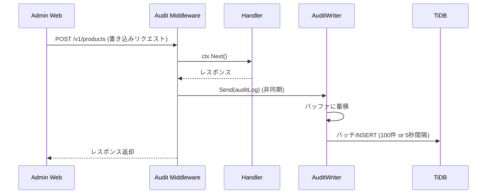
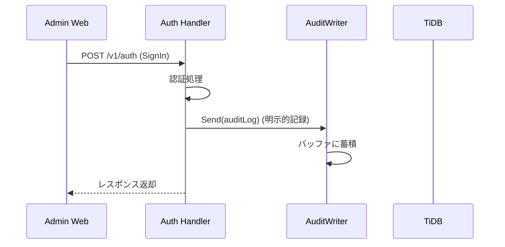

# 管理者監査ログ

| 項目 |  |
|----|--|
| 機能 | 管理者操作の監査ログ記録・閲覧 |

## 仕様

- ADR: [ADR-007: 管理者監査ログ](../../adr/007-admin-audit-logging.md)

## 設計概要

管理者Webでの書き込み操作（作成・更新・削除）と認証イベント（SignIn/SignOut）を自動的に記録し、管理画面から閲覧可能にする。Ginミドルウェアで全対象リクエストを自動キャプチャし、非同期バッチ書き込みでDBに保存する。

## 設計詳細

### DBスキーマ

```sql
CREATE TABLE IF NOT EXISTS `users`.`audit_logs` (
  `id`              VARCHAR(22)   NOT NULL,
  `created_at`      DATETIME(3)   NOT NULL,
  `admin_id`        VARCHAR(22)   NOT NULL DEFAULT '',
  `admin_type`      INT           NOT NULL DEFAULT 0,
  `action`          INT           NOT NULL DEFAULT 0,
  `resource_type`   VARCHAR(64)   NOT NULL DEFAULT '',
  `resource_id`     VARCHAR(64)   NOT NULL DEFAULT '',
  `result`          INT           NOT NULL DEFAULT 0,
  `result_detail`   VARCHAR(512)  NOT NULL DEFAULT '',
  `http_method`     VARCHAR(10)   NOT NULL DEFAULT '',
  `http_path`       VARCHAR(512)  NOT NULL DEFAULT '',
  `http_route`      VARCHAR(256)  NOT NULL DEFAULT '',
  `http_status`     INT           NOT NULL DEFAULT 0,
  `client_ip`       VARCHAR(45)   NOT NULL DEFAULT '',
  `user_agent`      TEXT          NOT NULL,
  `request_id`      VARCHAR(64)   NOT NULL DEFAULT '',
  `duration_ms`     INT           NOT NULL DEFAULT 0,
  `changed_fields`  JSON          NULL DEFAULT NULL,
  `metadata`        JSON          NULL DEFAULT NULL,
  `updated_at`      DATETIME(3)   NOT NULL,
  PRIMARY KEY (`id`),
  KEY `idx_audit_logs_admin_id_created_at` (`admin_id`, `created_at` DESC),
  KEY `idx_audit_logs_resource_created_at` (`resource_type`, `resource_id`, `created_at` DESC),
  KEY `idx_audit_logs_created_at` (`created_at` DESC),
  KEY `idx_audit_logs_action_result` (`action`, `result`, `created_at` DESC)
);
```

### エンティティ

| フィールド | 型 | 説明 |
|-----------|---|------|
| ID | string | Base58 UUID |
| CreatedAt | time.Time | 操作日時 |
| AdminID | string | 操作者ID |
| AdminType | int32 | 操作者種別 (1=Administrator, 2=Coordinator, 3=Producer) |
| Action | int32 | 操作種別 (1=Create, 2=Update, 3=Delete, 4=SignIn, 5=SignOut, 6=Export, 7=Upload) |
| ResourceType | string | リソース種別 (e.g., "product", "order") |
| ResourceID | string | リソースID |
| Result | int32 | 結果 (1=Success, 2=Failure, 3=Denied, 4=Error) |
| ResultDetail | string | エラー詳細 |
| HttpMethod | string | HTTPメソッド |
| HttpPath | string | HTTPパス (実値) |
| HttpRoute | string | HTTPルート (Ginパターン) |
| HttpStatus | int | HTTPステータス |
| ClientIP | string | 接続元IP |
| UserAgent | string | User-Agent |
| RequestID | string | リクエストID |
| DurationMs | int | 処理時間(ms) |
| ChangedFields | []string | 変更フィールド名一覧 |
| Metadata | map[string]string | 追加メタデータ |
| UpdatedAt | time.Time | GORM互換用 |

### API

#### エンドポイント

- `GET /v1/audit-logs` - 監査ログ一覧取得（Administrator のみ）

#### リクエストパラメータ

| パラメータ | 型 | 必須 | 説明 |
|-----------|---|------|------|
| limit | int | No | 取得上限数 (default: 20, max: 200) |
| offset | int | No | 取得開始位置 (default: 0) |
| adminId | string | No | 管理者IDでフィルタ |
| resourceType | string | No | リソース種別でフィルタ |
| action | int | No | 操作種別でフィルタ |
| startAt | int64 | No | 開始日時 (unix timestamp) |
| endAt | int64 | No | 終了日時 (unix timestamp) |

#### レスポンス

```json
{
  "auditLogs": [
    {
      "id": "xxxxxxxxxxxxxxxxxxxx",
      "createdAt": 1709251200,
      "adminId": "xxxxxxxxxxxxxxxxxxxx",
      "adminType": 1,
      "action": 1,
      "resourceType": "product",
      "resourceId": "xxxxxxxxxxxxxxxxxxxx",
      "result": 1,
      "resultDetail": "",
      "httpMethod": "POST",
      "httpPath": "/v1/products",
      "httpRoute": "/v1/products",
      "httpStatus": 200,
      "clientIp": "192.168.1.1",
      "userAgent": "Mozilla/5.0 ...",
      "requestId": "xxxx",
      "durationMs": 150,
      "changedFields": ["name", "description"],
      "metadata": {}
    }
  ],
  "total": 100
}
```

#### シーケンス





### 非同期ライター

- バッファサイズ: 1024
- バッチサイズ: 100
- フラッシュ間隔: 5秒
- チャネル満杯時: ログをドロップ（リクエストへの影響を防止）
- シャットダウン時: `Close()` で残りをフラッシュ、WaitGroupでgoroutine同期

### PII方針

**保存する**: adminID, IP, User-Agent, リソースID, HTTPパス, 変更フィールド名
**保存しない**: リクエスト/レスポンスボディ, パスワード, トークン, メールアドレス, カード情報

## チェックリスト

### 実装開始前

* [x] ADR作成・承認
* [x] テーブル設計レビュー
* [x] PII取り扱い方針の確認

### 動作確認

* [ ] マイグレーションSQLのローカルTiDB適用
* [ ] 管理画面から商品作成操作 → audit_logsテーブルにレコード挿入確認
* [ ] SignIn/SignOut → audit_logsテーブルに認証イベント記録確認
* [ ] GET /v1/audit-logs でログ一覧取得確認
* [ ] 各フィルタパラメータの動作確認

## リリース時確認事項

### リリース順

1. DBマイグレーション適用
2. APIデプロイ

### リリース制御

特になし（ミドルウェアは自動適用）

### インフラ設定

特になし

### パフォーマンスチェック

- 非同期バッチ書き込みのため、リクエストレイテンシへの影響は最小
- インデックスにより、一覧取得クエリは高速に実行可能

## 関連リンク

- [ADR-007: 管理者監査ログ](../../adr/007-admin-audit-logging.md)
