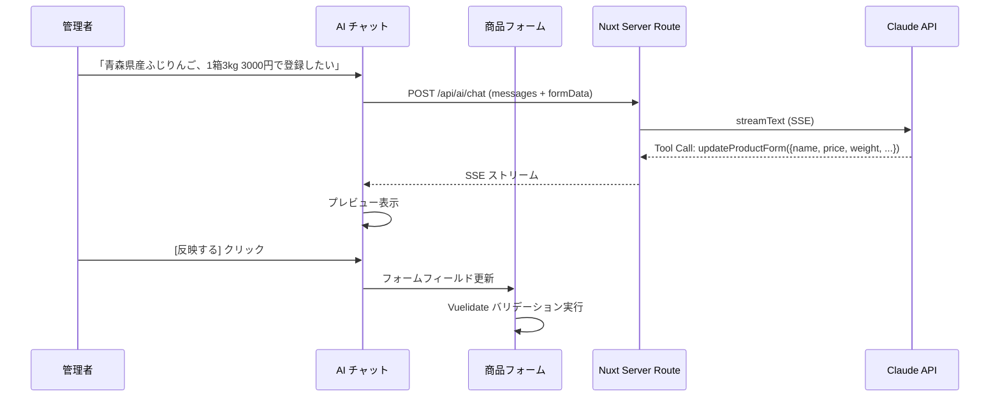
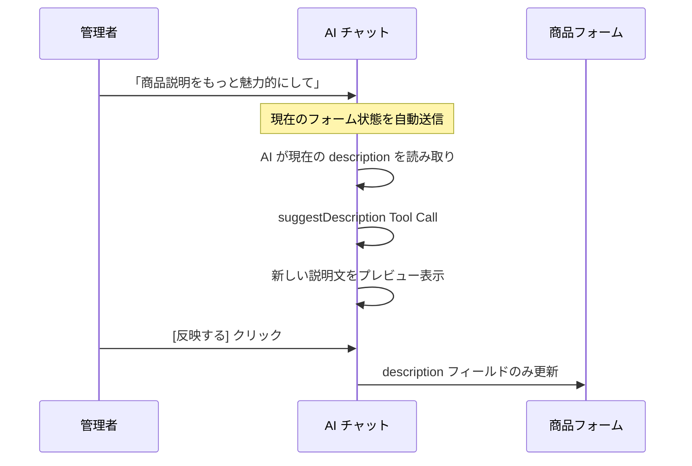
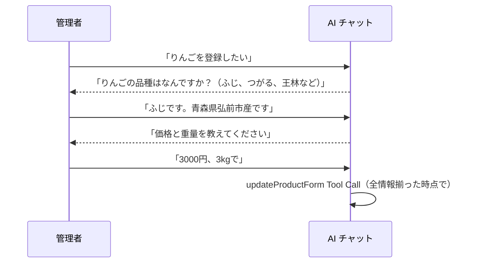

# 商品登録・編集 AI アシスタント機能

| 項目 | 内容 |
|----|---|
| 機能 | 商品登録・編集フォームに対話形式の AI アシスタントを導入し、自然言語でフォーム入力・編集を支援する |

## 仕様

### 背景・課題

商品登録フォームは 25 以上のフィールド（8 セクション）を持つ複雑な構成であり、以下の課題がある:

1. **入力負荷が高い**: 商品名・説明文・おすすめポイント・価格・配送設定など多数のフィールドを手動入力
2. **コンテンツ生成の難しさ**: 魅力的な商品説明文やおすすめポイントの作成にはライティングスキルが必要
3. **フィールド依存関係の複雑さ**: カテゴリ→品目、都道府県→市区町村などの連鎖的な選択
4. **繰り返し作業**: 類似商品の登録時に毎回ゼロから入力

### 解決策

フォーム横にチャットパネルを設置し、AI と対話しながら:
- 自然言語で商品情報を伝え、フォームを自動入力
- 既存フォーム内容の一部修正・改善をリクエスト
- 商品説明文やおすすめポイントの生成・ブラッシュアップ

## 設計概要

### アーキテクチャ

```
┌─────────────────────────────────────────────────────────┐
│  Browser (Nuxt SPA)                                     │
│                                                         │
│  ┌──────────────────────┐  ┌─────────────────────────┐  │
│  │ 商品フォーム          │  │ AI チャットパネル        │  │
│  │ (既存の New/Edit)     │  │ (@ai-sdk/vue Chat)      │  │
│  │                      │←─│                         │  │
│  │ - 商品名             │  │ Tool: updateProductForm │  │
│  │ - 説明文             │  │ → データプレビュー       │  │
│  │ - 価格               │  │ → ユーザー承認          │  │
│  │ - カテゴリ           │  │ → フォーム反映          │  │
│  │ - etc.               │  │                         │  │
│  └──────────────────────┘  └─────────────────────────┘  │
└─────────────────────────────────────────────────────────┘
          │                           │
          │ REST (既存API)             │ SSE (AI SDK Stream)
          ▼                           ▼
┌──────────────────┐       ┌─────────────────────────┐
│ Go マイクロサービス │       │ Nuxt Server Route        │
│ (既存 Product API) │       │ server/api/ai/chat.post.ts│
└──────────────────┘       │                         │
                           │ streamText + tools      │
                           └─────────────────────────┘
                                      │
                                      │ HTTPS (SSE)
                                      ▼
                           ┌─────────────────────────┐
                           │ Anthropic Claude API     │
                           │ (claude-sonnet-4-5)      │
                           └─────────────────────────┘
```

### 技術選定

| 項目 | 選定 | 理由 |
|------|------|------|
| ストリーミング方式 | SSE (Server-Sent Events) | LLM 応答は単方向ストリーム。AI SDK が内部で管理 |
| フロントエンド SDK | Vercel AI SDK v6 (`ai` + `@ai-sdk/vue`) | Vue/Nuxt 公式サポート、Tool Calling 対応、SSE ストリーミング内蔵 |
| AI プロバイダー | Anthropic Claude (`@ai-sdk/anthropic`) | 日本語品質、Tool Use、Structured Output 対応 |
| バックエンドプロキシ | Nuxt Server Route (Nitro) | API キーのサーバーサイド管理、既存 Nuxt 構成に統合可能 |
| 構造化データ抽出 | Tool Calling + Zod スキーマ | フォームフィールドへの型安全なマッピング |

### SSE を選定した理由

| 技術 | 方向性 | 適合度 | 備考 |
|------|--------|--------|------|
| **SSE** | サーバー→クライアント（単方向） | **最適** | LLM のトークンストリーミングに最適。OpenAI/Anthropic 両方が SSE をネイティブ採用 |
| WebSocket | 双方向 | 過剰 | AI チャットでは双方向通信は不要。接続管理のオーバーヘッドが大きい |
| Fetch ReadableStream | サーバー→クライアント | 代替可 | AI SDK が内部で使用。直接使う必要はない |

SSE は HTTP 標準に準拠しているため、既存のプロキシ・ロードバランサーとの互換性が高く、自動再接続機能も内蔵されている。

### Vercel AI SDK v6 を選定した理由

2026年現在、AI チャット UI 構築の事実上の標準。主な利点:

1. **Vue/Nuxt ファーストクラスサポート**: `@ai-sdk/vue` の `Chat` クラスでリアクティブなチャット状態管理
2. **Tool Calling 統合**: Zod スキーマ定義 → AI が構造化データを返却 → フォーム反映のパイプラインが一貫
3. **ストリーミング組み込み**: SSE パース、チャンク処理、エラーハンドリングを内部管理
4. **マルチプロバイダー**: Anthropic/OpenAI/Google を統一 API で切り替え可能
5. **Tool 承認フロー**: `needsApproval` による UI 上でのユーザー確認が標準サポート

## 設計詳細

### Web

#### 新規パッケージ

```json
{
  "dependencies": {
    "ai": "^6.0.0",
    "@ai-sdk/vue": "^3.0.0",
    "@ai-sdk/anthropic": "^2.0.0",
    "zod": "^3.24.0"
  }
}
```

#### エンドポイント（Nuxt Server Route）

- `POST /api/ai/chat` — AI チャットストリーミングエンドポイント

#### コンポーネント構成

```
web/admin/src/
├── server/
│   └── api/
│       └── ai/
│           └── chat.post.ts          # Nuxt Server Route (AI proxy)
├── components/
│   └── organisms/
│       └── ai-assistant/
│           ├── AiChatPanel.vue       # チャットパネル本体
│           ├── AiChatMessage.vue     # メッセージ表示コンポーネント
│           ├── AiChatInput.vue       # 入力フォーム
│           └── AiFormPreview.vue     # フォーム変更プレビュー
├── composables/
│   └── useProductAiAssistant.ts      # AI アシスタントロジック
├── lib/
│   └── ai/
│       ├── tools.ts                  # Tool 定義（Zod スキーマ）
│       └── system-prompt.ts          # システムプロンプト
└── types/
    └── ai.ts                         # AI 関連型定義
```

#### 詳細設計

##### 1. Nuxt Server Route (`server/api/ai/chat.post.ts`)

```typescript
import { streamText, convertToModelMessages, UIMessage } from 'ai'
import { anthropic } from '@ai-sdk/anthropic'

export default defineLazyEventHandler(async () => {
  const config = useRuntimeConfig()

  return defineEventHandler(async (event) => {
    const { messages, formData } = await readBody<{
      messages: UIMessage[]
      formData: Record<string, unknown>
    }>(event)

    const result = streamText({
      model: anthropic('claude-sonnet-4-5-20250514'),
      system: buildSystemPrompt(formData),
      messages: await convertToModelMessages(messages),
      tools: {
        updateProductForm,   // フォームフィールド更新
        suggestDescription,  // 商品説明文生成
        suggestPoints,       // おすすめポイント生成
      },
      maxSteps: 3,
    })

    return result.toUIMessageStreamResponse()
  })
})
```

##### 2. Tool 定義 (`lib/ai/tools.ts`)

フォーム操作を行う 3 つの Tool を定義:

**updateProductForm** — フォームフィールドの一括更新

```typescript
import { z } from 'zod'
import { tool } from 'ai'

export const updateProductForm = tool({
  description: '商品登録フォームのフィールドを更新する。ユーザーが自然言語で伝えた商品情報を構造化して反映する。',
  inputSchema: z.object({
    name: z.string().max(128).optional()
      .describe('商品名'),
    description: z.string().max(20000).optional()
      .describe('商品説明文'),
    price: z.number().min(0).optional()
      .describe('販売価格（税込・円）'),
    cost: z.number().min(0).optional()
      .describe('原価（税込・円）'),
    inventory: z.number().min(0).optional()
      .describe('在庫数'),
    weight: z.number().min(0).optional()
      .describe('重量（kg）'),
    itemUnit: z.string().max(16).optional()
      .describe('単位（例: 個, 瓶, 箱, kg）'),
    itemDescription: z.string().max(64).optional()
      .describe('内容量の説明'),
    deliveryType: z.enum(['normal', 'refrigerated', 'frozen']).optional()
      .describe('配送温度帯'),
    storageMethodType: z.enum(['normal', 'coolDark', 'refrigerated', 'frozen']).optional()
      .describe('保存方法'),
    expirationDate: z.number().min(0).optional()
      .describe('賞味期限（製造日からの日数）'),
    recommendedPoint1: z.string().max(128).optional()
      .describe('おすすめポイント1'),
    recommendedPoint2: z.string().max(128).optional()
      .describe('おすすめポイント2'),
    recommendedPoint3: z.string().max(128).optional()
      .describe('おすすめポイント3'),
    originPrefectureCode: z.number().min(1).max(47).optional()
      .describe('原産地の都道府県コード（1=北海道〜47=沖縄）'),
    originCity: z.string().max(32).optional()
      .describe('原産地の市区町村'),
  }),
})

export const suggestDescription = tool({
  description: '商品の特徴から魅力的な商品説明文を生成する',
  inputSchema: z.object({
    description: z.string().max(20000)
      .describe('生成された商品説明文'),
    tone: z.enum(['formal', 'casual', 'storytelling'])
      .describe('文体のトーン'),
  }),
})

export const suggestPoints = tool({
  description: '商品のおすすめポイントを3つ生成する',
  inputSchema: z.object({
    point1: z.string().max(128).describe('おすすめポイント1'),
    point2: z.string().max(128).describe('おすすめポイント2'),
    point3: z.string().max(128).describe('おすすめポイント3'),
  }),
})
```

##### 3. システムプロンプト (`lib/ai/system-prompt.ts`)

```typescript
export function buildSystemPrompt(currentFormData: Record<string, unknown>): string {
  return `あなたは「ふるマル」の商品登録アシスタントです。
管理者が商品を登録・編集する際に、自然言語での指示をフォームデータに変換します。

## あなたの役割
- ユーザーの自然言語による商品説明からフォームフィールドを抽出・提案する
- 商品説明文やおすすめポイントの生成・改善を支援する
- 不足している情報があれば確認する
- 日本の地域特産品・農産物に関する知識を活用する

## 現在のフォーム状態
${JSON.stringify(currentFormData, null, 2)}

## ルール
- 更新するフィールドのみを含める（変更不要なフィールドは省略）
- 価格は税込の円で扱う
- 都道府県コードは1（北海道）〜47（沖縄）の数値
- 配送温度帯: normal（常温）, refrigerated（冷蔵）, frozen（冷凍）
- 保存方法: normal（常温）, coolDark（冷暗所）, refrigerated（冷蔵）, frozen（冷凍）
- おすすめポイントは各128文字以内
- 商品説明は20,000文字以内
- ユーザーが日本語で話しかけたら日本語で返答する`
}
```

##### 4. AI チャットパネル (`components/organisms/ai-assistant/AiChatPanel.vue`)

```
┌──────────────────────────────────┐
│  🤖 AI アシスタント        [×]   │ ← ヘッダー（閉じるボタン）
├──────────────────────────────────┤
│                                  │
│  👤 青森県産のふじりんごを       │ ← ユーザーメッセージ
│     登録したいです。1箱3kg      │
│     で3,000円です。              │
│                                  │
│  🤖 商品情報を整理しました。     │ ← AI メッセージ
│     以下の内容でフォームに       │
│     反映しますか？               │
│                                  │
│  ┌────────────────────────────┐  │
│  │ 📋 フォーム更新プレビュー  │  │ ← Tool Call プレビュー
│  │                            │  │
│  │ 商品名: ふじりんご（青森産）│  │
│  │ 価格: ¥3,000              │  │
│  │ 重量: 3.0 kg              │  │
│  │ 原産地: 青森県             │  │
│  │ 配送: 常温                 │  │
│  │                            │  │
│  │  [✓ 反映する] [✕ やめる]   │  │ ← 承認ボタン
│  └────────────────────────────┘  │
│                                  │
├──────────────────────────────────┤
│  [メッセージを入力...]    [送信] │ ← 入力エリア
└──────────────────────────────────┘
```

レイアウト: フォーム右側にドロワー形式で表示（幅 400px）。
トグルボタンでフォーム右下に FAB（Floating Action Button）として配置。

##### 5. Composable (`composables/useProductAiAssistant.ts`)

```typescript
// Chat クラスのラッパー + フォーム連携ロジック
export function useProductAiAssistant(formData: Ref<ProductFormData>) {
  // AI SDK Chat インスタンス
  // メッセージ送信時に現在のフォーム状態を自動付与
  // Tool Call 結果をフォームに反映するハンドラ
  // パネル開閉状態の管理
}
```

##### 6. フォーム統合

既存の `ProductNew.vue` / `ProductEdit.vue` テンプレートに以下を追加:

- AI アシスタント FAB ボタン（右下固定）
- `<AiChatPanel>` コンポーネントの配置
- `useProductAiAssistant` composable の呼び出し

フォーム自体の既存ロジック（バリデーション、API 呼び出し等）には手を加えない。

#### UX フロー

##### フロー 1: 新規商品の一括入力



##### フロー 2: 既存フィールドの部分編集



##### フロー 3: 対話的な情報補完



### API

#### エンドポイント

既存の Product API に変更なし。

AI チャット用のエンドポイントは Nuxt Server Route として実装:

- `POST /api/ai/chat` — AI チャットストリーミング

#### 環境変数（追加）

| 変数名 | 説明 | 必須 |
|--------|------|------|
| `ANTHROPIC_API_KEY` | Anthropic API キー | Yes |
| `AI_MODEL` | 使用モデル ID（デフォルト: `claude-sonnet-4-5-20250514`） | No |

`nuxt.config.ts` の `runtimeConfig` に追加（`public` ではなくサーバーサイドのみ）:

```typescript
runtimeConfig: {
  ANTHROPIC_API_KEY: process.env.ANTHROPIC_API_KEY || '',
  AI_MODEL: process.env.AI_MODEL || 'claude-sonnet-4-5-20250514',
  public: {
    // 既存の public config...
  },
}
```

### セキュリティ

| 項目 | 対策 |
|------|------|
| API キー保護 | Nuxt Server Route 内でのみ使用。クライアントに公開しない |
| レート制限 | Nuxt Server Route にレート制限ミドルウェアを追加 |
| 入力サニタイズ | Tool の Zod スキーマによる型安全な入力検証 |
| 認証 | 既存の Firebase Auth トークンを Server Route で検証 |

### パフォーマンス

| 項目 | 対策 |
|------|------|
| 初回応答速度 | SSE ストリーミングによりトークン単位で即座に表示開始 |
| バンドルサイズ | AI SDK は tree-shakable。チャットパネルは dynamic import |
| メモリ使用量 | 会話履歴は最新 20 メッセージに制限 |
| API コスト | claude-sonnet-4-5 使用で応答品質とコストのバランスを確保 |

## チェックリスト

### 実装開始前

* [ ] Anthropic API キーの発行・環境変数設定
* [ ] AI SDK v6 (`ai`, `@ai-sdk/vue`, `@ai-sdk/anthropic`) のバージョン確認
* [ ] Nuxt Server Route の動作確認（ssr: false 環境でも利用可能か）
* [ ] 既存フォームの formData の ref 構造確認
* [ ] Tool 定義の Zod スキーマと既存バリデーションルールの整合性確認
* [ ] Vuetify ナビゲーションドロワーとの共存確認

### 動作確認

* [ ] チャットパネルの開閉動作
* [ ] メッセージ送信・ストリーミング表示
* [ ] Tool Call によるフォームプレビュー表示
* [ ] プレビュー承認後のフォーム反映
* [ ] フォーム反映後の Vuelidate バリデーション動作
* [ ] 部分更新（一部フィールドのみ変更）の動作
* [ ] 商品説明文・おすすめポイント生成の動作
* [ ] エラーハンドリング（API エラー、ネットワークエラー）
* [ ] レスポンシブ表示（モバイルでの動作）
* [ ] 新規登録・編集の両方での動作確認
* [ ] 既存フォーム操作との干渉がないこと
* [ ] 未保存変更ガードとの共存確認

## リリース時確認事項

### リリース順

1. Nuxt Server Route（AI プロキシ）
2. AI 関連ライブラリ・型定義・ユーティリティ
3. AI チャットパネルコンポーネント
4. 商品フォームへの統合

### リリース制御

- Feature Flag による段階的リリースを推奨
- 初期は特定の管理者ロールのみに公開

### インフラ設定

- `ANTHROPIC_API_KEY` 環境変数の設定（本番・ステージング）
- SSE 接続のタイムアウト設定（リバースプロキシ側: 120秒以上）
- `proxy_buffering off` の設定（Nginx 等で SSE を使う場合）

### パフォーマンスチェック

- ストリーミング開始までのレイテンシ測定（目標: 1秒以内）
- チャットパネルの dynamic import によるバンドルサイズ影響確認

### その他

- Anthropic API の利用料金モニタリング設定
- エラー発生時の Sentry 通知確認

## 関連リンク

- [Vercel AI SDK v6 ドキュメント](https://ai-sdk.dev/docs)
- [AI SDK + Nuxt Getting Started](https://ai-sdk.dev/docs/getting-started/nuxt)
- [@ai-sdk/vue](https://www.npmjs.com/package/@ai-sdk/vue)
- [Anthropic Claude API](https://docs.anthropic.com/en/docs/build-with-claude/tool-use)
- [商品管理ページUI改善](./20250915_product-pages-ui-improvement.md)
