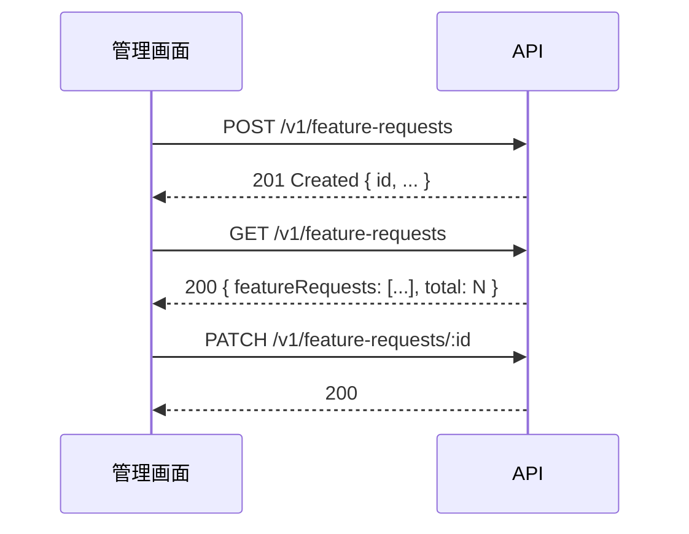

# 要望リクエスト機能（管理画面）

| 項目 | 値 |
|----|--|
| 機能 | 管理画面への要望リクエスト機能追加 |

## 仕様

コーディネーターがプラットフォームへの機能改善・新機能の要望を管理者に提出し、管理者が要望の受付・ステータス管理・フィードバックを行える機能を管理画面に追加する。

## 設計概要

現状、コーディネーターがプラットフォームへの要望を伝える手段として一般的な「お問い合わせ（contacts）」しか存在しないため、要望の追跡・優先度管理が困難。

本機能では以下を実現する：
- **コーディネーター**: 要望を提出し、進捗を確認できる
- **管理者（Administrator）**: 全要望を一覧管理し、ステータス更新・コメントを残せる

### データモデル

```typescript
interface FeatureRequest {
  id: string
  title: string           // タイトル（128文字以内）
  description: string     // 要望内容（2000文字以内）
  category: number        // カテゴリ（UI改善 / 新機能 / パフォーマンス / その他）
  priority: number        // 優先度（低 / 中 / 高）
  status: number          // ステータス（受付中 / 検討中 / 採用決定 / 開発中 / 完了 / 却下）
  note: string            // 管理者コメント（2000文字以内）
  submittedBy: string     // 提出者 admin ID
  submitterName: string   // 提出者名
  createdAt: number       // Unix timestamp
  updatedAt: number       // Unix timestamp
}
```

### ステータス定義

| 値 | 定数名 | 表示名 | 説明 |
|---|---|---|---|
| 1 | Waiting | 受付中 | 提出直後の初期状態 |
| 2 | Reviewing | 検討中 | 管理者が確認・検討している |
| 3 | Adopted | 採用決定 | 実装することが決まった |
| 4 | InProgress | 開発中 | 実装中 |
| 5 | Done | 完了 | リリース済み |
| 6 | Rejected | 却下 | 採用しないことに決定 |

### カテゴリ定義

| 値 | 表示名 |
|---|---|
| 1 | UI/UX改善 |
| 2 | 新機能 |
| 3 | パフォーマンス改善 |
| 4 | その他 |

### 優先度定義

| 値 | 表示名 |
|---|---|
| 1 | 低 |
| 2 | 中 |
| 3 | 高 |

### 権限設計

| 操作 | 管理者 | コーディネーター |
|---|---|---|
| 要望の提出 | ✅ | ✅ |
| 全要望の一覧表示 | ✅ | ❌（自分の提出のみ） |
| 要望の詳細表示 | ✅ | ✅（自分の提出のみ） |
| ステータス変更・コメント | ✅ | ❌ |
| 要望の削除 | ✅ | ✅（自分の提出かつ受付中のみ） |

## 設計詳細

### Web（フロントエンド）

#### ファイル構成

```
web/admin/src/
├── types/
│   └── feature-request.ts              # ローカル型定義
├── store/
│   └── feature-request.ts              # Pinia store
├── pages/
│   └── feature-requests/
│       ├── index.vue                   # 一覧ページ
│       ├── new.vue                     # 新規登録ページ
│       └── [id]/
│           └── index.vue              # 詳細・管理ページ
└── components/
    └── templates/
        └── feature-request/
            ├── List.vue               # 一覧テンプレート
            ├── New.vue                # 新規登録テンプレート
            └── Edit.vue               # 詳細・管理テンプレート
```

#### 画面一覧

| パス | 役割 | 表示対象 |
|---|---|---|
| `/feature-requests` | 一覧表示 | 管理者: 全件 / コーディネーター: 自分の提出 |
| `/feature-requests/new` | 要望提出フォーム | 全ロール |
| `/feature-requests/:id` | 詳細・ステータス管理 | 管理者: 編集可 / コーディネーター: 閲覧のみ |

#### バリデーション

| フィールド | ルール |
|---|---|
| title | 必須・128文字以内 |
| description | 必須・2000文字以内 |
| category | 必須 |
| priority | 必須 |
| note（管理者コメント） | 2000文字以内 |
| status（ステータス変更） | 必須 |

### API（バックエンド）

> **現状**: フロントエンドは localStorage を一時的なバックエンドとして使用する（モック実装）。
> バックエンド API の実装後は、store 内の TODO コメント箇所を実 API 呼び出しに差し替える。

#### エンドポイント（将来実装）

| メソッド | パス | 説明 |
|---|---|---|
| GET | /v1/feature-requests | 一覧取得（limit, offset, status フィルタ対応） |
| POST | /v1/feature-requests | 新規作成 |
| GET | /v1/feature-requests/:id | 詳細取得 |
| PATCH | /v1/feature-requests/:id | ステータス更新・コメント更新 |
| DELETE | /v1/feature-requests/:id | 削除 |

#### シーケンス（将来実装）



## チェックリスト

### 実装開始前

* [x] データモデルの設計確認
* [x] 権限設計の確認（管理者 vs コーディネーター）
* [x] 既存の contacts 機能との差別化確認

### 動作確認

* [ ] 要望の新規提出ができる
* [ ] 一覧ページで要望が表示される
* [ ] 詳細ページでステータス・コメント更新できる（管理者）
* [ ] コーディネーターは自分の要望のみ表示される（ページリフレッシュ後も永続）
* [ ] バリデーションエラーが適切に表示される

## リリース時確認事項

### リリース順

フロントエンドのみのリリースで動作する（localStorage モック）。

バックエンド API 実装後は、`store/feature-request.ts` の各 action 内の `// TODO:` コメントを実 API 呼び出しに差し替え、`types/feature-request.ts` を `types/api/v1/` 配下の自動生成型に移行する。

### インフラ設定

初期リリース: なし（localStorage モック）
バックエンド統合時: DB テーブル・API サーバーの追加が必要

## 関連リンク

- [お問い合わせ管理（既存）](/web/admin/src/pages/contacts/)
- [お知らせ管理（既存）](/web/admin/src/pages/notifications/)
