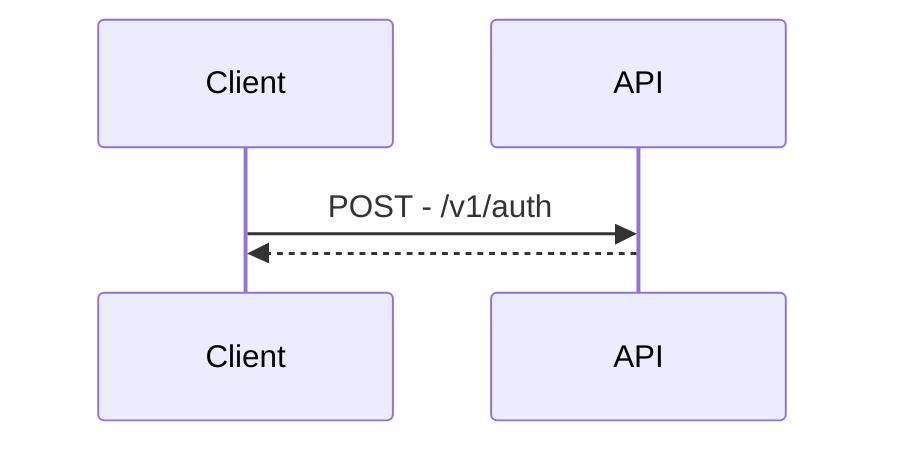

# Title

| 項目 |  |
|----|--|
| 機能 |  |

## 仕様

<!-- 仕様書（Asana/DocBase）リンクを貼る -->

## 設計概要

<!-- 概要を端的に記載する -->

## 設計詳細

### Web

#### エンドポイント

<!-- 実装/変更するエンドポイントを箇条書きで記載する -->

### API

#### エンドポイント

<!-- 実装/変更するエンドポイントを箇条書きで記載する -->

#### シーケンス

<!-- GitHubプレビューに対応している Mermaid記法 でシーケンス図を記載する -->

## チェックリスト

### 実装開始前

<!-- 実装開始前に考慮漏れが無いか確認すること -->

* [ ] aaa
* [ ] bbb

### 動作確認

<!-- リリース前動作確認時に考慮漏れが無いか確認すること -->

* [ ] aaa
* [ ] bbb

## リリース時確認事項

### リリース順

<!-- Web,APIのリリース順に依存関係がある場合、リリースする順序を記載する -->

### リリース制御

<!-- Feature Flagでの設定有無など、リリース前後での制御設定があれば記載する -->

### インフラ設定

<!-- 環境変数の変更やその他GCPリソースの設定が必要な場合は記載する -->

### パフォーマンスチェック

<!-- パフォーマンス影響がある変更の場合、Explainの確認結果を記載する -->

### その他

<!-- その他確認・共有事項があれば記載する -->

## 関連リンク
